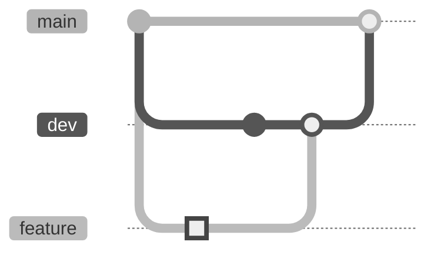

[Git](https://git-scm.com/) and [GitHub](https://github.com/) are methods of **version control**. Git is a command-line tool that takes snapshots of your code at a moment in time, each change in your code is a **commit**. Git allows you to effectively and efficiently manage team code projects. GitHub is a company owned by Microsoft which provides a free Git server so you can upload Git projects to the internet, and track issues.

# Why should we care?

Git may seem complicated, and potentially not worth the time investment. 

Version control is **essential** to managing team projects, without it it would be impossible to determine whose changes affect your code. Say you are at a competition and your auto is broken, but you knew it was working at the last competition. You could look at the file history and see what changes have happened, and **revert** the file back to the working version. 

Many IDEs provide a more user-friendly approach to version control by adding a GUI for Git so you don't have to navigate Git through terminal commands.

# FtcRobotController

`FtcRobotController` is a Git **repository** for the First Tech Challenge. This repository will contain the code you write for the robot. You can either clone or **fork** the repository, what we will do is **fork** the repository. Navigate to the [repository](https://github.com/First-Tech-Challenge/FtcRobotController) and click the **Fork** button in the corner.

![[ftcrobotcontroller.png]]

Then you should have a screen like this:

![[fork_screen.png]]

Here you choose an owner of the repository if you have a GitHub organization, or rename the repository to something more friendly like `Season2026Code`.

# Commits

A commit is a timestamp of changes to files. When you are done with your changes to a codebase you should **push** a commit. You give commits messages, try to make these useful. See below for some good commit message examples.

|                   Good                    |         Bad         |
| :---------------------------------------: | :-----------------: |
|     fix: reversed arm motor direction     |    fix arm motor    |
|       feat: add flywheel controller       |    add flywheel     |
| feat: add apriltag detection to CloseBlue | modify CloseBlue.kt |

Generally you should aim to provide a brief description of what you changed, and avoid just stating the file you made changes in.

# Branches

Git branches are like versions of a codebase, a good practice is to have a stable branch that you know will always work, and another branch for development that may have broken behavior. Once you know the development branch works fine and is ready to use, you should **merge** the branch by opening a **Pull Request**. See below for an example:

The Git graph shows `dev` should inherit from `main` and that `feature` branches should inherit from dev, feature branches should **merge** into dev before merging into main.

## Pull Requests

Pull requests are a specific way to merge branches, a Pull Request is a GitHub feature that allows people to comment, and request changes before merging the branches. I recommend always using pull requests instead of manually merging commits.

